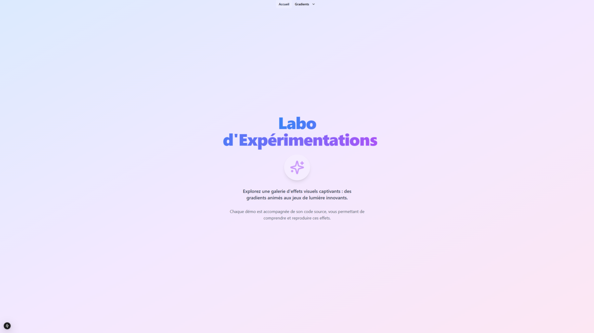

# Labo d'Expérimentations Web

Bienvenue dans ce laboratoire d'expérimentations web ! Ce projet est conçu pour explorer, tester et partager des effets visuels et styles modernes en frontend. L'objectif est de fournir des démonstrations claires et accessibles, avec du code facile à comprendre et à réutiliser dans vos propres projets.

Chaque démonstration est pensée pour répondre à des besoins spécifiques en design et effets visuels. Par exemple, si vous cherchez à ajouter un background dégradé, vous pourrez explorer ici différentes façons de le réaliser et récupérer le code correspondant. Ce laboratoire propose également des liens vers des outils en ligne utiles (comme des générateurs de backgrounds) pour vous accompagner dans vos créations. Des outils spécifiques pourraient également être intégrés directement dans le projet à l'avenir.



## Aperçu

Ce laboratoire offre une galerie d’expérimentations, allant des gradients animés aux jeux de lumière en passant par des blobs animés et bien plus encore. Les démonstrations exploitent CSS pur, Tailwind CSS, React, et Next.js pour créer des effets visuels immersifs. Chaque démo inclut son code source, conçu pour être facilement compréhensible et adaptable dans divers projets web.

## Fonctionnalités

- **Effets et styles variés** : Expérimentations de gradients animés, jeux de lumière, blobs animés, et autres styles avancés.
- **Technologies utilisées** : CSS pur, Tailwind CSS, React, Next.js.
- **Navigation simplifiée** : Parcours intuitif entre les différents effets et démonstrations.
- **Code source prêt à l’emploi** : Code fourni pour chaque effet, facilement intégrable et modifiable pour répondre aux besoins de votre projet.
- **Responsive design** : Conçu pour une expérience optimale sur tous les appareils.
- **Flexibilité multi-frameworks** : Exemples adaptables aux environnements et technologies de votre choix.

## Installation

1. Clonez ce dépôt :
   ```bash
   git clone https://github.com/votre-utilisateur/votre-repo.git
   ```
2. Suivez les instructions spécifiques à chaque expérimentation dans leurs dossiers respectifs.
3. Pour les démonstrations React/Next.js :
   - Installez les dépendances avec :
     ```bash
     npm install
     ```
   - Lancez le serveur de développement avec :
     ```bash
     npm run dev
     ```

## Utilisation

Naviguez dans les sections pour découvrir et tester divers effets visuels et styles. Chaque page propose une démonstration interactive accompagnée du code source, pour vous aider à comprendre et réutiliser ces effets dans vos propres projets. Vous trouverez également des liens vers des outils externes qui facilitent la création d’éléments visuels, et d'autres outils pourraient être intégrés directement dans le projet à l'avenir.

## Contribution

Ce projet est ouvert aux contributions de la communauté ! Proposez des pull requests pour ajouter de nouveaux effets ou améliorer ceux existants, ou ouvrez une issue pour partager vos idées et suggestions.

## Licence

Ce projet est sous licence [MIT](https://choosealicense.com/licenses/mit/).

## Topics

Pour aider à la découverte et l'accessibilité, ce dépôt est tagué avec les topics suivants :

- `react`
- `nextjs`
- `tailwindcss`
- `css`
- `frontend`
- `ui-experiments`
- `visual-effects`
- `animations`
- `css-animations`
- `gradients`
- `web-design`
- `interactive-ui`
- `javascript`
- `web-animations`
- `design-systems`
- `frontend-lab`
- `ui-components`
- `creative-coding`
- `web-experiments`
- `open-source`
